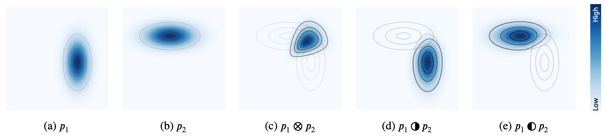
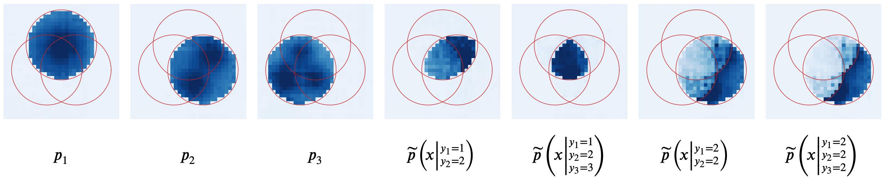
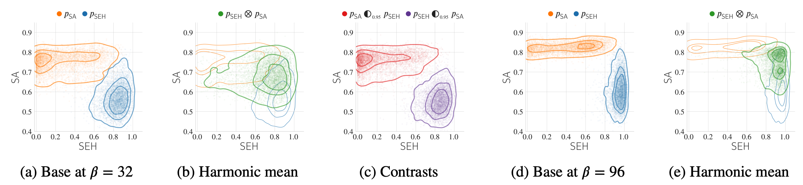
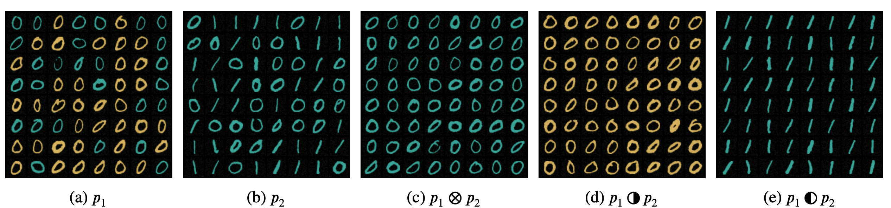

# Compositional Sculpting of Iterative Generative Processes 

PyTorch implementation of the experiments from the paper

"[Compositional Sculpting of Iterative Generative Processes](https://arxiv.org/abs/2309.16115)" (NeurIPS 2023)

by [Timur Garipov](https://timgaripov.github.io/), [Sebastiaan De Peuter](https://scholar.google.com/citations?user=xxp2We8AAAAJ), [Ge Yang](https://www.episodeyang.com/), [Vikas Garg](http://www.mit.edu/~vgarg/), [Samuel Kaski](https://people.aalto.fi/samuel.kaski), [Tommi Jaakkola](http://people.csail.mit.edu/tommi/)

## Introduction

High training costs of generative models and the need to fine-tune them for specific tasks have created a strong interest in model reuse and composition.
A key challenge in composing iterative generative processes, such as GFlowNets and diffusion models, is that to realize the desired target distribution, all steps of the generative process need to be coordinated, and satisfy delicate balance conditions.
In this work, we propose Compositional Sculpting: a general approach for defining compositions of iterative generative processes.
We then introduce a method for sampling from these compositions built on classifier guidance.
We showcase ways to accomplish compositional sculpting in both GFlowNets and diffusion models.
We highlight two binary operations &#x2014; the **harmonic mean** ($p_1 \otimes p_2$) and the **contrast** ($p_1$ &#x25D1; $p_2$) between pairs, and the generalization of these operations to multiple component distributions.
We offer empirical results on image and molecular generation tasks.



Please cite our paper if you find it helpful in your work: 
```bibtex
@article{garipov2023compositional,
  title={Compositional Sculpting of Iterative Generative Processes},
  author={Garipov, Timur and De Peuter, Sebastiaan and Yang, Ge and Garg, Vikas and Kaski, Samuel and Jaakkola, Tommi},
  journal={Advances in Neural Information Processing Systems},
  volume={36},
  year={2023}
}
```

## Experiment domains

#### Composition of GFlowNets (2D grid domain)

See [gflownet/README.md](gflownet/README.md)



#### Composition of GFlowNets (fragment-based molecule generation domain)

See [gflownet/README.md](gflownet/README.md)



#### Composition of diffusion models (colored MNIST)

See [diffusion/README.md](diffusion/README.md) and [diffusion_chaining/README.md](diffusion_chaining/README.md)




## Code references

* Code for 2D grid GFlowNets (training and sampling) was adapted from https://gist.github.com/malkin1729/9a87ce4f19acdc2c24225782a8b81c15
* Code for fragment-based molecular graphs GFlowNets (training and sampling) was adapted from https://github.com/recursionpharma/gflownet (last synced on 2023-04-06, with commit [3d311c3](https://github.com/recursionpharma/gflownet/tree/3d311c3d0d18f3c7f9ce67dd1fff502c44ca57d9))
* Code for MNIST diffusion models (training and sampling) was adapted from https://colab.research.google.com/drive/120kYYBOVa1i0TD85RjlEkFjaWDxSFUx3?usp=sharing
